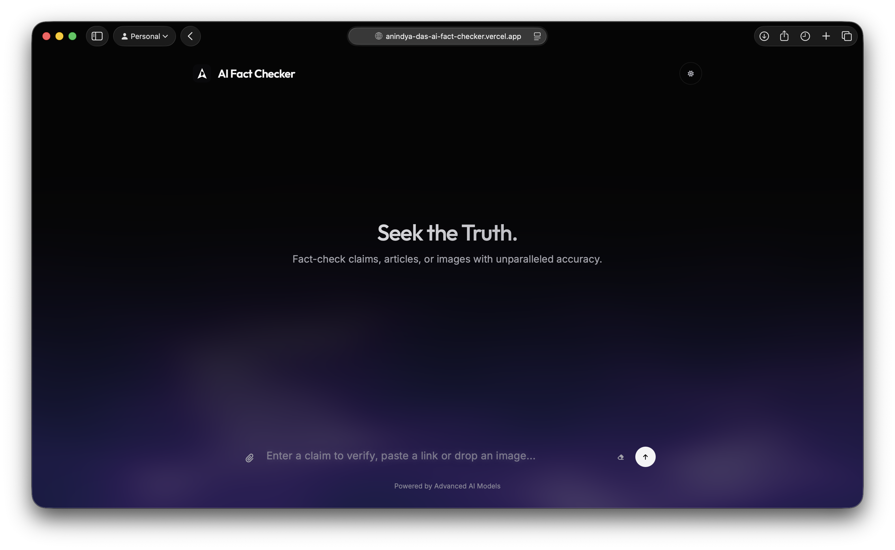
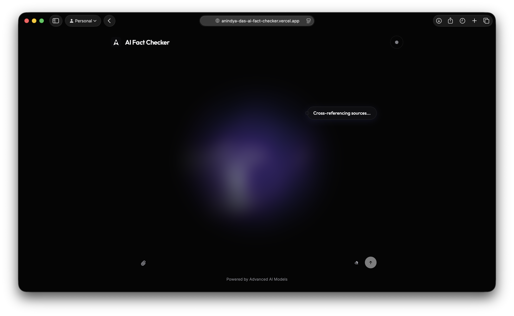
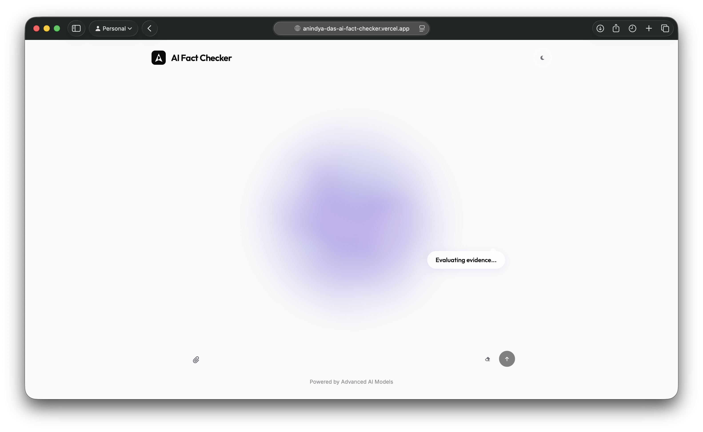
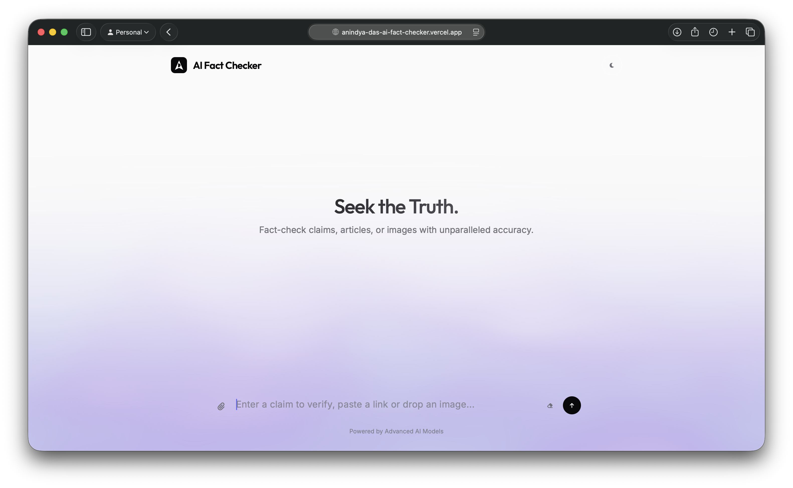

# AI Fact Checker — Seek the Truth

AI Fact Checker is a powerful, multi-modal tool designed to verify claims, articles, and images with unparalleled accuracy. By leveraging advanced AI models and real-time web grounding, it provides users with reasoned verdicts and cited evidence to combat misinformation.

<p align="center">
  
  
</p>
<p align="center">
  
  
</p>

## 🚀 Features

- **Multi-modal Verification**: Fact-check raw text, web URLs, or uploaded images (visual fact-checking).
- **Deep Web Extraction**: Intelligent content extraction from:
  - **Social Media**: Specialized adapters for **Twitter/X**, **Reddit**, **TikTok**, and **YouTube**.
  - **Articles**: High-fidelity scraping using `readability` and `BeautifulSoup`.
- **Hybrid AI Architecture**:
  - **Groq (Primary)**: Lightning-fast inference using Llama 3.3-70b and Llama 4 models.
  - **Google Gemini (Grounding)**: Advanced reasoning and native Google Search grounding for real-time verification.
- **Evidence Grounding**: Every verdict is backed by confidence scores and a list of canonical source URLs.
- **Modern UI**: A responsive, dark-mode-first interface featuring glassmorphism, Three.js particle clouds, and interactive feedback.

## 🛠️ Tech Stack

- **Backend**: Python, Flask, BeautifulSoup4, Readability.js (Python port), Requests.
- **Frontend**: HTML5, Vanilla CSS, Vanilla JavaScript, Three.js (WebGL).
- **AI Infrastructure**: Groq API, Google Gemini API.
- **Deployment**: Optimized for Vercel.

## 📥 Installation

### Prerequisites
- Python 3.8+
- API Keys for [Groq](https://console.groq.com/) and [Google AI Studio (Gemini)](https://aistudio.google.com/).

### Setup
1. **Clone the repository**:
   ```bash
   git clone https://github.com/adunboxthetech/AI-fact-checker.git
   cd AI-fact-checker
   ```

2. **Install dependencies**:
   ```bash
   pip install -r requirements.txt
   ```

3. **Configure Environment Variables**:
   Create a `.env` file in the root directory and add your API keys:
   ```env
   GROQ_API_KEY=your_groq_api_key_here
   GEMINI_API_KEY=your_gemini_api_key_here
   ```

## 🚀 Running the App

1. **Start the Flask backend**:
   ```bash
   python app.py
   ```
2. **Access the interface**:
   The app serves `index.html` at `http://localhost:5000`. Simply open this URL in your browser.

## 🌐 Deployment

This project is configured for easy deployment on **Vercel**:
1. Install the Vercel CLI: `npm i -g vercel`
2. Run `vercel` in the project root.
3. Add `GROQ_API_KEY` and `GEMINI_API_KEY` to your Vercel Project Environment Variables.

---

Built with ❤️ by [AD_unboxthetech](https://github.com/adunboxthetech)
